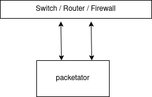
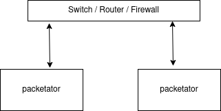

<div align="center">
 <h3>Packetator Setup</h3>
</div>


<!-- TABLE OF CONTENTS -->
<details open="open">
  <summary><h2 style="display: inline-block">Table of Contents</h2></summary>
  <ol>
    <li>
      <a href="#system-requirements">System Requirements</a>
    </li>
    <li>
      <a href="#installation">Installation</a>
    </li>
  </ol>
</details>

## System Requirements

### Recommended Hardware
- 8+ logical processor cores.
- 8+ GB of RAM.
- [OPTIONAL] 1 NIC dedicated to management of the system.
- 1 or more NICs dedicated to replay traffic.

Packetator is CPU-bound. Recommended hardware is based on running thousands of pcaps in a reasonable time frame. Scale up or down as needed.

Use of swap should be avoided if possible.

The network interfaces for the replay NICs need to be in the `UP` state.


### Network Configuration

#### Using in-use IP addresses
Packetator can be use IP addresses that are in use by the host. 
However, by default the host's TCP stack will send a RST packet in response to packets lacking a destination socket. The RST packets can be disabled using the following iptables rule:
```shell
iptables -A OUTPUT -p tcp --tcp-flags RST RST -j DROP
```
Dropping RST packets is not required when using IP addresses that are not in use by the host.

#### Promiscuous Mode (optional)
Promiscuous mode must be enabled on any switches (e.g. [VMware vSwitch](https://kb.vmware.com/s/article/1002934)) connected to the packetator network to make use of the features:
- Send/receive frames with MAC address other than the assigned MAC address.
- Send/receive IPv6 packets without an assigned IPv6 address. Otherwise, the last 3 bytes of IPv6 addresses used must match the last 3 bytes of the assigned IPv6 address.

#### Jumbo frames (optional)
Jumbo frames must be enabled to make use of the following features:
- Send/receive jumbo frames.
- Send/receive frames that have increased in size due to the addition of application data. Affects some pcaps (e.g. passive FTP) that are run in L5 mode.

Packetator cannot send/receive frames larger than what the underlying network supports. 


#### Number of Nodes
##### 1 packetator node configuration

<div align="center">
  
</div>

##### 2 packetator node configuration

<div align="center">
  
</div>

##### N packetator node configuration

packetator can be scaled to any number of packetator instances running on any number of servers.


## Installation

### Debian Package

_packetator_ can be installed using a Debian package (.deb) on Debian and Ubuntu. Debian packages are available under [Releases](https://github.com/ZwCreatePhoton/packetator/releases).
To install run:
```shell
sudo dpkg -i packetator_1.0.0_amd64.deb
```

_packetator_ will be installed to ```/opt/packetator``` by default:
The installation directory can be configured using the ```--instdir``` argument.
```shell
sudo dpkg --instdir=/opt/packetator -i packetator_1.0.0_amd64.deb
```


### Compilation

_packetator_ can be compiled from source for GNU/Linux.

#### Install dependencies:
```shell
sudo apt -y install git
sudo apt -y install cmake
sudo apt -y install libpcap-dev
```

#### Download source:
```shell
git clone --recurse-submodules -j8 https://github.com/ZwCreatePhoton/packetator.git 
```
#### Compile:
```shell
cd packetator
mkdir build ; cd build
cmake -DCMAKE_BUILD_TYPE=Release -DCMAKE_INSTALL_PREFIX=/opt/packetator ..
sudo make install -j 8
sudo rm install_manifest.txt
```
The installation directory, ```/opt/packetator``` in this case, is configurable

#### Build .deb package (optional)
```shell
make package
# package will be in ./packages/
```
